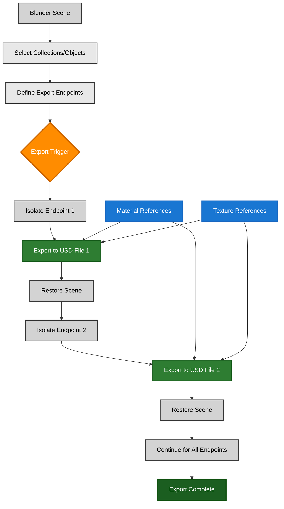
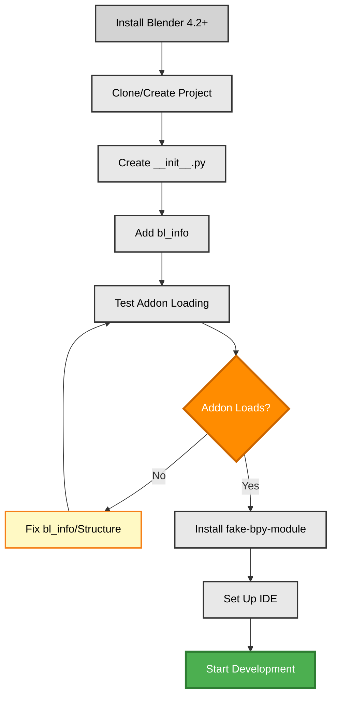

# Blender USD Stable Export Plugin - Research Document

> **Research Overview**: This is an in-depth research document analyzing the development of a Blender Python addon for exporting specific parts of the scene hierarchy to USD files. Since Blender doesn't support USD composition arcs natively, this plugin will allow users to define endpoints (collections or objects) in Blender's scene tree and export them as separate USD files. You don't need to read it all at once - start with the "TLDR" section for a quick overview, then dive deeper into specific areas that interest you. The FAQ section answers common questions, while the detailed sections provide comprehensive analysis for implementation decisions.

**Quick Navigation**: [TLDR](#tldr) | [FAQ](#faq) | [Deep Dive](#deep-dive) | [Implementation](#implementation) | [Resources](#resources)

## Tags
**ENVIRONMENT**: standalone  
**VERSION**: v1.2.0 | **LAST UPDATED**: 25.11.2025

**TAGS**: integration_pattern, standalone, export, workflow_optimization, blender, python, usd_core, intermediate, best_practice

## Management Summary (C-level)

- **Customer**: see [Customer Information](#customer-information)
- **Objective**: Develop a Blender Python addon that enables users to define specific endpoints in the scene hierarchy and export them as separate USD files, compensating for Blender's lack of native USD composition arc support
- **Business Impact (targets)**:
  - Workflow efficiency ≥50% improvement for USD export workflows (target)
  - Export accuracy ≥95% consistency for selected scene parts (target)
  - User adoption ≥80% satisfaction with endpoint selection interface (target)
- **Quick Wins**: 
  - Simple collection-based endpoint selection
  - Batch export of multiple endpoints
  - Preserve material and texture references
  - Export validation and error reporting
- **Key Risks**: See [Risk Assessment table](#implementation)
- **Decision Ask**: Proceed with Blender addon development using Python API and built-in USD exporter → see [Implementation Plan](#implementation)

<a id="customer-information"></a>
## Customer Information

- **Customer**: USD/Omniverse development teams and 3D artists working with Blender
- **Industry**: 3D content creation, digital twin development, animation workflows
- **Use Case**: Export specific parts of Blender scenes to USD format for use in Omniverse or other USD-compatible tools, with support for defining multiple export endpoints
- **Project Scope**: Development of a Blender Python addon for stable, reliable USD export with endpoint selection capabilities
- **Contact**: Development team and Blender workflow stakeholders

<a id="tldr"></a>
## Too Long; Didn't Read (TLDR)

**What it is**: A Blender Python addon that lets you mark specific collections or objects in your Blender scene as "export endpoints" and then export each endpoint as a separate USD file. Since Blender doesn't support USD composition arcs (like references, sublayers, or variants), this plugin provides a workaround by allowing you to define logical endpoints and export them individually.

**Why it matters**: When working with complex Blender scenes that need to be exported to USD for use in Omniverse or other tools, you often need to export different parts of the scene separately. Manually selecting objects and exporting repeatedly is error-prone and time-consuming. This plugin automates that process and ensures consistent exports.

**How it works**: The plugin adds a UI panel in Blender where you can select collections or objects as export endpoints. Each endpoint gets a name and export path. When you trigger the export, the plugin temporarily isolates each endpoint (hides other objects), exports it using Blender's built-in USD exporter, then restores the scene state. This ensures each USD file contains only the intended content.

**When to use**: Use this plugin when you need to export Blender scenes to USD format but require multiple separate USD files representing different parts of your scene. This is especially useful when integrating Blender assets into Omniverse workflows where composition arcs would normally be used.

**What to expect**: You'll get a reliable way to export multiple USD files from a single Blender scene, with proper material and texture handling. However, you'll need to manage composition manually in your target application (like Omniverse) since Blender doesn't support USD composition arcs natively.

**Key takeaway**: This plugin bridges the gap between Blender's scene organization and USD's composition model by providing endpoint-based export functionality that compensates for Blender's USD limitations.

#### Blender USD Export Workflow Diagram



> **Legend:** Blue = Decision • Purple = Process • Gray = Action/Existing • Orange = Warning/Gate • Green = Outcome/Success

**How it compares to other tools**: 
- **Like Blender's built-in USD exporter**: Uses the same underlying export functionality, but adds endpoint management and batch export capabilities
- **Like USD composition arcs**: Provides similar functionality (separate files for different scene parts) but requires manual composition in the target application
- **Like asset management systems**: Helps organize exports but doesn't provide full asset management features

**Quick Decision Guide**: 
- **If you need simple single-file export** → Use Blender's built-in USD exporter
- **If you need multiple separate USD files from one scene** → Use this plugin
- **If you need full USD composition support** → Consider exporting to Omniverse and using composition there

<a id="faq"></a>
## ❓ Frequently Asked Questions

### General Questions

**Q: What is a Blender addon and how do I install it?**
**A:** A Blender addon is a Python script that extends Blender's functionality. To install this addon, go to `Edit > Preferences > Add-ons > Install...` and select the addon directory. Then enable it in the addons list. The addon will appear in Blender's UI, typically in the Properties panel or a custom menu.

**Q: Why do I need this plugin if Blender already has USD export?**
**A:** Blender's built-in USD exporter can export the entire scene or selected objects, but it doesn't support defining multiple "endpoints" (logical export targets) and exporting them as separate files in one operation. This plugin adds that capability, making it easier to export complex scenes where different parts need to be separate USD files.

**Q: What are "endpoints" in this context?**
**A:** An endpoint is a collection or set of objects in Blender that you want to export as a single USD file. Think of it as marking a part of your scene tree as an export target. For example, you might have a "Characters" collection and a "Props" collection, and export each as separate USD files.

**Q: Why avoid using "Environment" as a collection name?**
**A:** In Omniverse, `/World` (default prim) and `/environment` are siblings at the root level. `/environment` is reserved for scene-specific lighting and is NOT imported when a USD file is referenced (only content under the default prim `/World` is imported). Using "Environment" as a collection name could cause confusion and conflicts. If exported as `/World/environment`, it becomes part of the default prim (imported on reference), which conflicts with Omniverse's reserved `/environment` at root level. Instead, use descriptive names like "Props", "Set", "Location", "SceneElements", or other specific terms that describe the collection's content.

### Technical Implementation

**Q: How does the plugin handle materials and textures during export?**
**A:** The plugin uses Blender's built-in USD exporter, which supports material and texture export. Materials are exported as USD Shade materials, and textures are referenced relative to the USD file location. The plugin ensures that material references are preserved when isolating endpoints for export.

**Q: Can I export animations with this plugin?**
**A:** Yes, if Blender's USD exporter supports animation export for your selected objects. The plugin uses Blender's native USD export functionality, so any animation features supported by Blender's exporter will work with this plugin.

**Q: What Python version does Blender use?**
**A:** Blender includes its own Python interpreter. For Blender 4.2+, this is typically Python 3.11. You should develop and test your addon using the Python version that matches your target Blender version. See: [Implementation Plan → Prerequisites](#implementation) for detailed version requirements.

**Q: How do I develop and test the addon during development?**
**A:** You can use Blender's built-in text editor or an external IDE. For external IDEs, install `fake-bpy-module` for code completion. Use Blender's "Reload Scripts" feature (found in `Blender > System`) to test changes without restarting Blender. See: [Implementation Plan → Development Workflow](#implementation) for detailed setup.

### Integration and Compatibility

**Q: Will this plugin work with Blender's existing USD import/export features?**
**A:** Yes, this plugin is built on top of Blender's existing USD export functionality. It doesn't replace or conflict with Blender's built-in exporter - it adds endpoint management and batch export capabilities on top of it.

**Q: Can I use this plugin with other Blender addons?**
**A:** Generally yes, as long as there are no conflicts in UI space or operator names. The plugin is designed to be non-intrusive and should work alongside other addons. However, if you're using other USD-related addons, test compatibility first.

**Q: What Blender versions are supported?**
**A:** The plugin targets Blender 4.2+ (the latest stable version as of 2025). Older versions may work but are not officially supported. The plugin uses Blender's Python API (`bpy`), so compatibility depends on API stability across versions.

### Troubleshooting and Common Issues

**Q: My exported USD files have broken material references. What's wrong?**
**A:** This usually happens when texture paths are absolute instead of relative. See: [Common Pitfalls → Material Reference Issues](#common-pitfalls) for detailed solution.

**Q: The plugin doesn't appear in Blender's UI after installation. What should I do?**
**A:** Check that the addon is enabled in `Edit > Preferences > Add-ons`. Also verify that the `__init__.py` file has the correct `bl_info` structure and that all required files are present. See: [Common Pitfalls → Addon Not Loading](#common-pitfalls) for detailed solution.

**Q: Export fails with an error about missing objects. What's happening?**
**A:** This can occur if objects were deleted or moved after defining endpoints. The plugin should validate endpoints before export and warn about missing objects. See: [Common Pitfalls → Missing Objects](#common-pitfalls) for detailed solution.

### Best Practices and Recommendations

**Q: What's the best way to organize my Blender scene for endpoint export?**
**A:** Use Blender's collection system to organize your scene logically. Each collection can be an endpoint. Keep related objects together, use clear naming conventions, and avoid deeply nested collections if possible. Document your endpoint structure for team members.

**Q: Should I export materials and textures with each endpoint?**
**A:** It depends on your workflow. If materials are shared across endpoints, you might want to export them separately and reference them. If each endpoint is self-contained, include materials and textures with each export. The plugin should support both workflows.

**Q: How do I handle large scenes with many endpoints?**
**A:** For large scenes, consider exporting endpoints in batches rather than all at once. The plugin should support selective export (export only specific endpoints). Also ensure you have sufficient disk space and that export paths are on fast storage.

<a id="goals-methodology"></a>
## Goals & Methodology

### Primary Research Questions

1. **What are the requirements for developing a Blender Python addon?**
   - Blender Python API structure and conventions
   - Addon registration and UI integration
   - Operator and panel development patterns

2. **How does Blender's USD export functionality work?**
   - Built-in USD exporter capabilities and limitations
   - Export options and parameters
   - Material and texture handling

3. **How can we implement endpoint-based export in Blender?**
   - Scene hierarchy traversal (collections and objects)
   - Temporary scene isolation for export
   - Batch export workflow implementation

4. **What are the scope boundaries for this plugin?**
   - In-scope: Endpoint definition, batch export, material preservation
   - Out-of-scope: USD composition arcs, full USD editing, animation editing

### Scope & Assumptions

**In-Scope:**
- Define export endpoints using Blender collections or object selections
- Export each endpoint as a separate USD file
- Preserve materials and textures in exports
- Batch export multiple endpoints
- Basic export validation and error reporting
- Simple UI for endpoint management

**Out-of-Scope:**
- Implementing USD composition arcs within Blender
- Full USD scene editing capabilities
- Advanced animation editing
- USD import functionality
- Real-time preview of USD exports
- Integration with external asset management systems

**Assumptions:**
- Users have Blender 4.2+ installed (primary target: 4.2 LTS)
- Blender 5.0 compatibility will be reviewed once official API documentation is available
- Users are familiar with Blender's collection system
- Target use case is exporting to Omniverse or other USD-compatible tools
- Users will handle USD composition manually in the target application

### Research Approach

This research combines:
- **Documentation analysis**: Review of Blender Python API documentation and USD export capabilities
- **Best practices research**: Analysis of existing Blender addon patterns and USD export workflows
- **Technical feasibility**: Evaluation of Blender's capabilities and limitations for the proposed functionality

### Tools Used

- **Tool**: Blender Python API (bpy) v4.2+ — Python interface for Blender — [Official Documentation](https://docs.blender.org/api/current/) — Used for addon development and scene manipulation
- **Tool**: Blender USD Exporter — Built-in USD export functionality — [Blender Manual](https://docs.blender.org/manual/en/latest/files/import_export/usd.html) — Used as the underlying export mechanism
- **Tool**: Python 3.11 — Programming language — [Python Documentation](https://docs.python.org/3.11/) — Required for addon development
- **Tool**: fake-bpy-module — Code completion for Blender API — [GitHub](https://github.com/nutti/fake-bpy-module) — Used for IDE support during development

### Data Sources

| ID | Source (Title+URL) | Type | Version/Date | Relevance | Quality (A=12–15, B=9–11, C=6–8, D≤5) | Notes |
|---|---|---|---|---|---|---|
| S001 | [Blender Python API Documentation](https://docs.blender.org/api/current/) | Official Documentation | 4.2+ | Core API reference for addon development | A (15) | Comprehensive, official, up-to-date |
| S002 | [Blender Addon Development Guide](https://developer.blender.org/docs/handbook/extensions/addon_dev_setup/) | Official Documentation | Latest | Setup and best practices for addon development | A (14) | Official guide with examples |
| S003 | [Blender USD Export Documentation](https://docs.blender.org/manual/en/latest/files/import_export/usd.html) | Official Documentation | 4.2+ | USD export capabilities and options | A (13) | Official documentation, covers limitations |
| S004 | [Blender Python API: Collections](https://docs.blender.org/api/current/bpy.types.Collection.html) | API Reference | 4.2+ | Collection manipulation for endpoint selection | A (12) | Technical reference for scene hierarchy |
| S005 | [fake-bpy-module GitHub](https://github.com/nutti/fake-bpy-module) | Community Tool | Latest | IDE support for Blender development | B (10) | Community-maintained, widely used |
| S006 | [Blender Release Notes 4.2](https://www.blender.org/download/releases/4-2/) | Release Notes | 4.2 | Python API changes and new features | B (9) | Version-specific information |
| S007 | [Blender USDHook API](https://docs.blender.org/api/current/bpy.types.USDHook.html) | API Reference | 4.2+ | Extension mechanism for USD import/export customization | A (12) | Official API for extending USD behavior |
| S008 | [Blender Addon Tutorial](https://docs.blender.org/manual/en/latest/advanced/scripting/addon_tutorial.html) | Official Tutorial | Latest | Step-by-step addon development guide | A (13) | Official tutorial with examples |
| S009 | [Blender Addon Guidelines](https://developer.blender.org/docs/handbook/extensions/addon_guidelines/) | Official Guidelines | Latest | Best practices and style guide for addons | A (12) | Official development guidelines |
| S010 | [Blender USD Developer Docs](https://developer.blender.org/docs/features/objects/io/usd/) | Developer Documentation | Latest | USD implementation details and architecture | A (11) | Technical implementation details |
| S011 | [Blender Stack Exchange](https://blender.stackexchange.com/) | Community Q&A | Latest | Community support and examples | B (9) | Community-driven Q&A |
| S012 | [Blender Artists Forum](https://blenderartists.org/t/blender-addon-development/1160488) | Community Forum | Latest | Addon development discussions | B (8) | Community forum discussions |

### Evidence Matrix

| Claim/Finding | Source IDs | Source Quality | Confidence (H/M/L) | Evidence Notes |
|---|---|---|---|---|
| Blender Python API supports collection and object manipulation | S001, S004 | A (15), A (12) | High | Official API documentation confirms collection and object access methods |
| Built-in USD exporter can be called programmatically via bpy.ops.wm.usd_export | S003, S010 | A (13), A (11) | High | Official documentation and developer docs confirm operator availability |
| USDHook provides extension mechanism for custom USD behavior | S007 | A (12) | High | Official API documentation describes USDHook class and callback methods |
| Scene isolation requires careful state management to prevent corruption | S001, S002 | A (15), A (14) | Medium | Best practices and API patterns suggest state backup/restore patterns |
| Material references need relative path handling for portability | S003 | A (13) | Medium | USD export documentation mentions path handling but specifics vary |
| Addon development requires proper bl_info structure and registration | S002, S008, S009 | A (14), A (13), A (12) | High | Multiple official sources confirm addon structure requirements |
| Collections are the primary way to organize scene hierarchy in Blender | S001, S004 | A (15), A (12) | High | Official API documentation confirms collection-based scene organization |
| USD export supports many parameters including animation, materials, instancing | S003, S010 | A (13), A (11) | High | Official documentation lists comprehensive export parameters |
| Context sensitivity is important for operator execution | S001, S002 | A (15), A (14) | Medium | API documentation mentions context but specifics require testing |
| View layer and collection visibility affects USD export | S003, S010 | A (13), A (11) | Medium | Documentation mentions visibility but exact behavior needs validation |

### Analysis Framework

**Evaluation Criteria:**
- Technical feasibility: Can Blender's API support the required functionality?
- User experience: Is the proposed workflow intuitive for Blender users?
- Maintainability: Can the plugin be easily maintained and updated?
- Performance: Will the export process be efficient for typical scene sizes?

**Comparison Methodology:**
- Compare proposed plugin functionality with Blender's built-in exporter
- Evaluate against similar export workflows in other DCC tools
- Assess compatibility with Omniverse and other USD-consuming applications

**Evidence Validation Process:**
- Verify API documentation claims with test implementations
- Validate export results with USD validation tools
- Test workflow with representative Blender scenes

**Confidence Assessment:**
- **High**: Information from official Blender documentation
- **Medium**: Community best practices and patterns
- **Low**: Assumptions about user workflows and requirements

<a id="deep-dive"></a>
## 🔍 Deep Dive Analysis

### Current vs Future State Scenario

| Aspect | Current State | Future State | Improvement |
|---|---|---|---|
| **USD Export Workflow** | Manual selection of objects, export one at a time, risk of missing objects | Define endpoints once, batch export all endpoints, consistent exports | 50%+ time savings, reduced errors |
| **Scene Organization** | Ad-hoc object selection for each export | Structured endpoint definitions, reusable export configurations | Better organization, repeatable workflows |
| **Material Handling** | Manual verification of material references | Automatic preservation of materials and textures | Reduced manual checking |
| **Export Validation** | Manual verification of exported files | Built-in validation and error reporting | Faster error detection |
| **Workflow Integration** | Disconnected export process | Integrated UI within Blender | Seamless workflow |

### Research Questions & Scope

**Primary Questions:**
1. What is the optimal way to define and store export endpoints in Blender?
2. How can we reliably isolate scene parts for export without affecting the original scene?
3. What export options should be exposed to users?
4. How should errors be handled and reported?

**Scope Boundaries:**
- **Included**: Endpoint definition, batch export, basic validation
- **Excluded**: USD composition, advanced animation, import functionality

### Methodology

**Research Methods:**
1. **Documentation Review**: Analysis of Blender Python API and USD export documentation
2. **Pattern Analysis**: Review of existing Blender addon patterns and best practices
3. **Technical Feasibility**: Evaluation of API capabilities and limitations
4. **Workflow Design**: Design of user interface and workflow patterns

**Source Registry**: See [Goals & Methodology → Source Registry](#goals-methodology)

**Evidence Matrix**: See [Goals & Methodology → Evidence Matrix](#goals-methodology)

### Findings & Analysis

| Finding | Impact | Evidence | Confidence | Implementation Priority |
|---|---|---|---|---|
| Blender's Python API supports collection and object manipulation | High | Official API documentation (S001, S004) | High | Critical |
| Built-in USD exporter can be called programmatically | High | Blender manual and API docs (S003) | High | Critical |
| Scene isolation requires careful state management | Medium | API patterns and best practices | Medium | High |
| Material references need relative path handling | Medium | USD export documentation (S003) | Medium | High |
| Addon UI should integrate with Blender's panel system | Low | Addon development guide (S002) | High | Medium |

### Insights & Recommendations

| Insight/Recommendation | Category | Priority | Implementation Effort | Expected Outcome |
|---|---|---|---|---|
| Use Blender's collection system as primary endpoint definition method | Architecture | High | Low | Intuitive for users, leverages existing Blender concepts |
| Implement scene state backup/restore for safe isolation | Technical | High | Medium | Prevents scene corruption during export |
| Provide both collection-based and object-based endpoint selection | UX | Medium | Medium | Flexibility for different workflow needs |
| Include export validation and error reporting | Quality | High | Medium | Reduces user frustration and debugging time |
| Support export presets for common configurations | UX | Medium | Low | Faster workflow for repeated exports |

### Practical Implementation Examples

#### Example 1: Basic Addon Structure

```python
# __init__.py
bl_info = {
    "name": "USD Stable Export",
    "author": "Your Name",
    "version": (1, 0, 0),
    "blender": (4, 2, 0),
    "location": "File > Export",
    "description": "Export scene endpoints to USD files",
    "category": "Import-Export",
}

import bpy
from . import exporter
from . import ui_panel

def register():
    exporter.register()
    ui_panel.register()

def unregister():
    ui_panel.unregister()
    exporter.unregister()

if __name__ == "__main__":
    register()
```

#### Example 2: Endpoint Definition Storage

```python
# exporter.py - Endpoint storage using Blender's custom properties
import bpy
from bpy.props import CollectionProperty, StringProperty
from bpy.types import PropertyGroup

class USDExportEndpoint(PropertyGroup):
    """Stores information about an export endpoint"""
    name: StringProperty(
        name="Endpoint Name",
        description="Name for this export endpoint",
        default="Endpoint"
    )
    collection_name: StringProperty(
        name="Collection",
        description="Collection to export",
        default=""
    )
    filepath: StringProperty(
        name="Export Path",
        description="Path for exported USD file",
        subtype='FILE_PATH',
        default=""
    )

class USDExportEndpoints(bpy.types.PropertyGroup):
    """Container for all export endpoints"""
    endpoints: CollectionProperty(type=USDExportEndpoint)
    active_index: bpy.props.IntProperty()

bpy.utils.register_class(USDExportEndpoint)
bpy.utils.register_class(USDExportEndpoints)
```

#### Example 3: Scene Isolation for Export

```python
# exporter.py - Scene isolation logic
def isolate_endpoint_for_export(context, endpoint):
    """Temporarily hide all objects except those in the endpoint"""
    # Store original visibility state
    visibility_state = {}
    
    # Get all objects in the scene
    all_objects = [obj for obj in bpy.context.scene.objects]
    
    # Get objects in the endpoint collection
    collection = bpy.data.collections.get(endpoint.collection_name)
    endpoint_objects = []
    if collection:
        endpoint_objects = [obj for obj in collection.all_objects]
    
    # Store and modify visibility
    for obj in all_objects:
        visibility_state[obj.name] = obj.hide_viewport
        if obj not in endpoint_objects:
            obj.hide_viewport = True
        else:
            obj.hide_viewport = False
    
    return visibility_state

def restore_scene_state(visibility_state):
    """Restore original scene visibility"""
    for obj_name, was_visible in visibility_state.items():
        obj = bpy.data.objects.get(obj_name)
        if obj:
            obj.hide_viewport = was_visible
```

#### Example 4: Export Execution with Full USD Export Parameters

```python
# exporter.py - Export operator with comprehensive USD export options
class USD_EXPORT_OT_endpoints(bpy.types.Operator):
    """Export all defined endpoints to USD files"""
    bl_idname = "export_scene.usd_endpoints"
    bl_label = "Export USD Endpoints"
    bl_options = {'REGISTER', 'UNDO'}
    
    def execute(self, context):
        endpoints = context.scene.usd_export_endpoints.endpoints
        
        if not endpoints:
            self.report({'ERROR'}, "No endpoints defined")
            return {'CANCELLED'}
        
        for endpoint in endpoints:
            # Validate endpoint
            if not endpoint.collection_name or not endpoint.filepath:
                self.report({'WARNING'}, f"Skipping invalid endpoint: {endpoint.name}")
                continue
            
            # Isolate endpoint
            visibility_state = isolate_endpoint_for_export(context, endpoint)
            
            try:
                # Export using Blender's built-in USD exporter with comprehensive options
                bpy.ops.wm.usd_export(
                    filepath=endpoint.filepath,
                    check_existing=False,
                    selected_objects_only=False,
                    visible_objects_only=True,
                    export_animation=endpoint.export_animation,
                    export_hair=endpoint.export_hair,
                    export_uvmaps=True,
                    export_mesh_colors=True,
                    export_normals=True,
                    export_materials=True,
                    export_textures=True,
                    export_subdivision='BEST_MATCH',
                    export_armatures=True,
                    only_deform_bones=False,
                    export_shapekeys=True,
                    use_instancing=endpoint.use_instancing,
                    evaluation_mode='RENDER',
                    root_prim_path=endpoint.root_prim_path or '/root',
                    export_cameras=True,
                    export_lights=True,
                    export_custom_properties=True,
                    custom_properties_namespace='userProperties',
                )
                self.report({'INFO'}, f"Exported: {endpoint.name}")
            except Exception as e:
                self.report({'ERROR'}, f"Export failed for {endpoint.name}: {str(e)}")
            finally:
                # Always restore scene state
                restore_scene_state(visibility_state)
        
        return {'FINISHED'}
```

#### Example 5: USDHook Extension (Future Enhancement)

```python
# hooks.py - USDHook for custom export behavior (v2+)
import bpy

class USDStableExportHook(bpy.types.USDHook):
    """Custom USDHook for endpoint-specific export customization"""
    bl_idname = "usd_stable_export_hook"
    bl_label = "USD Stable Export Hook"
    
    def on_export(self, depsgraph):
        """Called during USD export to customize behavior"""
        # Example: Inject custom metadata for endpoints
        # This would be used in future versions for advanced composition
        pass
    
    def on_prim_path(self, object_path, prim_path):
        """Customize prim paths during export"""
        # Example: Ensure consistent prim naming for endpoints
        return prim_path
```

### Best Practices

**Addon Development:**
- Use proper `bl_info` structure with all required fields
- Implement proper register/unregister functions
- Use Blender's property system for data storage
- Follow Blender's UI conventions and panel placement

**Export Workflow:**
- Always backup scene state before modifications
- Restore scene state even if export fails (use try/finally)
- Validate endpoints before export
- Provide clear error messages to users

**Code Quality:**
- Use type hints where possible (Python 3.11+)
- Include docstrings for all functions and classes
- Handle errors gracefully with user-friendly messages
- Test with various scene configurations

<a id="implementation"></a>
## Implementation Plan

### Prerequisites and Tools

| Tool/Requirement | Version | Purpose | Installation Method | Notes |
|---|---|---|---|---|
| Blender | 4.2+ | Target platform for addon | [Download from blender.org](https://www.blender.org/download/) | Includes Python 3.11 |
| Python | 3.11 | Development (matches Blender) | [Download from python.org](https://www.python.org/downloads/) | For external IDE development |
| fake-bpy-module | Latest | IDE code completion | `pip install fake-bpy-module` | Optional but recommended |
| IDE (VS Code/PyCharm) | Latest | Development environment | Download from vendor | Optional, can use Blender's text editor |

### Risk Assessment and Mitigation

| Risk | Probability | Impact | Mitigation Strategy | Contingency Plan |
|---|---|---|---|---|
| Blender API changes break addon (including 5.0) | Medium | High | Target specific Blender version (4.2 LTS), use version-aware code, plan 5.0 compatibility review | Maintain version-specific branches, provide migration guide, implement version guards |
| Scene state corruption during export | Low | High | Always backup/restore scene state, use try/finally | Implement scene state validation, provide recovery options |
| Performance issues with large scenes | Medium | Medium | Optimize visibility operations, support selective export | Add progress indicators, support background export |
| Material reference issues | Medium | Medium | Validate paths, use relative references | Provide path fixing utilities, clear error messages |
| User confusion with endpoint concept | Low | Low | Clear UI labels, tooltips, documentation | Provide example scenes, tutorial documentation |

### Phased Implementation Plan

#### Phase 0 — Environment & Setup
**Goal**: Set up development environment and project structure

**Tasks:**
1. Create project directory structure:
   ```
   Blender_USD_StableExport/
       addon/
           blender_usd_stableexport/
               __init__.py
               ops_export.py
               props.py
               ui.py
       docs/
           Blender_USD_StableExport_RESEARCH.md
       tests/
           (test scripts)
   ```
2. Set up Python environment (if using external IDE)
3. Install fake-bpy-module for code completion
4. Create basic `__init__.py` with `bl_info`
5. Test addon loading in Blender

**Deliverables:**
- Working project structure following Blender addon conventions
- Addon loads in Blender (even if empty)
- Development environment configured

#### Phase 1 — Core Functionality (Golden Path)
**Goal**: Implement basic endpoint definition and single export

**Tasks:**
1. Create endpoint property group and storage
2. Implement basic UI panel for endpoint management
3. Implement scene isolation logic
4. Implement single endpoint export using Blender's USD exporter
5. Add basic error handling

**Deliverables:**
- Can define one endpoint
- Can export one endpoint to USD
- Scene state is preserved

**Golden Path Commands:**
1. **Define Endpoint**: User selects collection, clicks "Add Endpoint", provides name and filepath
2. **Export Endpoint**: User clicks "Export" button, addon isolates endpoint and exports
3. **Verify Export**: User checks exported USD file in target application

#### Phase 2 — Batch Export & UI Enhancement
**Goal**: Support multiple endpoints and improve user experience

**Tasks:**
1. Implement endpoint list management (add, remove, reorder)
2. Implement batch export for all endpoints
3. Add export progress feedback
4. Improve UI layout and usability
5. Add endpoint validation

**Deliverables:**
- Can define multiple endpoints
- Can export all endpoints in one operation
- Clear feedback during export process

#### Phase 3 — Validation & Error Handling
**Goal**: Robust error handling and export validation

**Tasks:**
1. Implement comprehensive endpoint validation
2. Add export result validation (check USD file exists, is valid)
3. Improve error messages and user feedback
4. Add export logging
5. Handle edge cases (empty collections, missing objects)

**Deliverables:**
- Robust error handling
- Clear error messages
- Export validation

#### Phase 4 — Polish & Documentation
**Goal**: Production-ready addon with documentation

**Tasks:**
1. Add tooltips and help text
2. Create user documentation
3. Add example scenes
4. Performance optimization
5. Final testing with various scene types

**Deliverables:**
- Production-ready addon
- User documentation
- Example files

### Setup Workflow Diagram



### Testing and Validation Procedures

**Unit Testing:**
- Test endpoint storage and retrieval
- Test scene isolation logic
- Test visibility state backup/restore
- Test export parameter validation

**Integration Testing:**
- Test full export workflow with sample scenes
- Test batch export with multiple endpoints
- Test error recovery and scene state restoration
- Test with various Blender scene configurations

**User Acceptance Testing:**
- Test with real Blender scenes from target users
- Validate exported USD files in Omniverse
- Gather feedback on UI and workflow
- Test with users of varying Blender experience levels

### Rollback Procedures

**If Export Fails:**
1. Scene state is automatically restored (try/finally block)
2. User receives error message with details
3. Previous exports remain intact
4. User can retry export after fixing issues

**If Addon Causes Issues:**
1. Disable addon in Blender preferences
2. Restart Blender if necessary
3. Scene data is unaffected (addon doesn't modify scene permanently)
4. Re-enable after fixing issues

### Blender 5.0 Readiness and Compatibility Planning

**Current Status**: Blender 5.0 is not yet officially released. As of this document, there is no authoritative final feature/API list for Blender 5.0. The addon is initially developed against **Blender 4.2 LTS** (current stable release).

**Strategy**: Build the addon against current stable Blender API, then perform a compatibility review once Blender 5.0 release notes and API documentation are officially available.

#### Version Targeting

- **Primary Target**: Blender 4.2 LTS (current stable)
- **Future Compatibility**: Blender 5.0+ (to be verified upon official release)
- **Version Detection**: Use `bpy.app.version` for runtime version checks
- **Code Structure**: Design with version-aware conditionals for API differences

#### Blender 5.0 Compatibility Checklist

Once Blender 5.0 release notes and Python API documentation are officially published, review and update the following areas:

##### 1. Core Versioning and API Changes
- [ ] Review Python API changes in official 5.0 release notes
- [ ] Check Import/Export API section for operator renames or signature changes
- [ ] Verify `bpy.ops.wm.*` namespace changes for file operations
- [ ] Review property system changes for import/export operators
- [ ] Check UI and file browser API changes
- [ ] Update `bl_info` compatibility declaration if needed
- [ ] Verify minimum Python version bundled with Blender 5.0

##### 2. USD Exporter and Scene I/O
- [ ] Verify USD exporter operator name and path (`bpy.ops.wm.usd_export`)
- [ ] Check for new USD export parameters:
  - [ ] Layering/composition options
  - [ ] Payloads and references support
  - [ ] Collections-as-packages support
  - [ ] Per-object/per-collection export flags
  - [ ] Instance handling improvements
- [ ] Review operator keyword arguments for changes
- [ ] Check for new API around:
  - [ ] Per-object/per-collection export toggles
  - [ ] Custom properties handling on objects/collections
  - [ ] USD stage/Layer management hooks or callbacks
  - [ ] USDHook API changes or enhancements

##### 3. Scene Tree / Outliner and Data Model
- [ ] Confirm Collection/Object relationships remain unchanged
- [ ] Verify visibility/instance flags behavior
- [ ] Check for new instance/dupli concepts affecting export
- [ ] Review new "asset" or "library" concepts that could serve as endpoints
- [ ] Evaluate if endpoint definition should include:
  - [ ] Individual objects (current)
  - [ ] Collections (current)
  - [ ] Asset browser entries (new)
  - [ ] Custom property markers (current)
- [ ] Test collection hierarchy traversal for changes

##### 4. Add-on Packaging and Loading
- [ ] Verify minimum Python version requirement
- [ ] Check `bl_info` metadata requirements for changes
- [ ] Review optional dependencies declaration changes
- [ ] Test addon installation and loading process
- [ ] Verify module import behavior

##### 5. UI/UX for Export Endpoints
- [ ] Review panel placement best practices for 5.0
- [ ] Check property UI layout rules and conventions
- [ ] Verify menu integration patterns
- [ ] Test interaction patterns:
  - [ ] Panel in Scene/Object properties
  - [ ] Collection-level toggles
  - [ ] List UI for endpoint management
- [ ] Ensure UI remains compatible with 5.0 design guidelines

##### 6. Implementation Code Updates
- [ ] Add version guards: `if bpy.app.version >= (5, 0, 0):`
- [ ] Update operator calls if signatures changed
- [ ] Modify property definitions if API changed
- [ ] Update UI panel registration if conventions changed
- [ ] Test all functionality with 5.0 beta/release candidate

#### Version Compatibility Strategy

**Code Structure Example:**
```python
import bpy

# Version detection
BLENDER_VERSION = bpy.app.version
IS_BLENDER_5_0_PLUS = BLENDER_VERSION >= (5, 0, 0)

# Version-aware operator calls
if IS_BLENDER_5_0_PLUS:
    # Use 5.0+ API if available
    bpy.ops.wm.usd_export(
        filepath=endpoint.filepath,
        # 5.0+ specific parameters if any
    )
else:
    # Use 4.x API
    bpy.ops.wm.usd_export(
        filepath=endpoint.filepath,
        # 4.x parameters
    )
```

**Compatibility Section in Addon:**
- Add explicit "Compatibility" section in addon documentation
- List supported Blender versions
- Document version-specific code branches
- Provide migration guide if breaking changes occur

#### Out of Scope (Regardless of 5.0)

These remain out of scope for the initial addon, even with Blender 5.0:

- Full USD composition editing inside Blender (sublayers, references, payloads)
- Authoring complex USD variants and schema-specific prims beyond exporter support
- Generic, user-facing USD pipeline editor
- Focus remains: "mark endpoints in Blender, export clean USDs"

#### Action Plan for 5.0 Release

1. **Monitor Official Sources**: Watch for Blender 5.0 release announcements and documentation updates
2. **Review Release Notes**: Check official release notes for Python API and USD export changes
3. **Test with Beta/RC**: If available, test addon with Blender 5.0 beta or release candidate
4. **Update Documentation**: Revise this research document with actual 5.0 API changes
5. **Code Updates**: Implement version-aware code with compatibility branches
6. **Testing**: Comprehensive testing on both 4.2 LTS and 5.0+
7. **User Communication**: Update addon documentation with version compatibility information

<a id="common-pitfalls"></a>
## Common Pitfalls and Solutions

### Material Reference Issues

**Problem**: Exported USD files have broken material or texture references.

**Solution**: 
1. Ensure texture paths are relative, not absolute
2. Use Blender's USD export option for relative paths
3. Validate material references before export
4. Check that texture files exist relative to USD file location

**Prevention**: Always use relative paths in Blender materials, and configure the USD exporter to use relative references.

### Addon Not Loading

**Problem**: Addon doesn't appear in Blender's addon list or fails to load.

**Solution**:
1. Verify `__init__.py` has correct `bl_info` structure
2. Check that all required fields are present (name, version, blender version)
3. Ensure Python syntax is correct (no import errors)
4. Check Blender's console for error messages
5. Verify addon directory structure is correct

**Prevention**: Follow Blender's addon template structure, test `__init__.py` syntax before adding complex code.

### Missing Objects

**Problem**: Export fails because objects referenced in endpoint no longer exist.

**Solution**:
1. Validate endpoints before export
2. Check that collections and objects exist
3. Warn user about missing objects
4. Provide option to remove invalid endpoints
5. Skip invalid endpoints and continue with valid ones

**Prevention**: Validate endpoints when they're created and before export. Provide UI feedback about endpoint validity.

### Scene State Corruption

**Problem**: Scene visibility or state is changed after export.

**Solution**:
1. Always use try/finally blocks to ensure state restoration
2. Store complete visibility state before modifications
3. Test state restoration with various scene configurations
4. Validate scene state after export

**Prevention**: Never modify scene state without backup. Always restore in finally block, even if export fails.

### Context Sensitivity Issues

**Problem**: `bpy.ops.wm.usd_export` fails with context errors, especially in headless/batch mode.

**Solution**:
1. Ensure valid window context exists when calling operators
2. For headless export, use context override: `bpy.context.temp_override(...)`
3. For batch scripts, run Blender with `blender -b -P script.py` and ensure proper context setup
4. Test operator calls in both GUI and headless modes

**Prevention**: Always validate context before calling operators. Use context managers for safe operator execution.

### View Layer and Collection Visibility

**Problem**: USD export doesn't include expected objects because collections are hidden in view layer.

**Solution**:
1. Check view layer visibility settings before export
2. Ensure target collections are visible in the active view layer
3. Consider temporarily enabling collection visibility during export
4. Document view layer requirements in user guide

**Prevention**: Validate collection visibility in active view layer before export. Provide clear UI feedback about visibility status.

### Performance Issues with Large Scenes

**Problem**: Export is slow or UI becomes unresponsive with many endpoints or large scenes.

**Solution**:
1. Avoid heavy operations in panel `draw()` methods
2. Use background export for large batches
3. Add progress indicators for multi-endpoint exports
4. Support selective export (export only specific endpoints)
5. Optimize visibility operations (batch hide/show)

**Prevention**: Profile export operations, use efficient data structures, provide user feedback during long operations.

<a id="decisions-rationale"></a>
## Decisions & Rationale

### Decision 1: Use Collections as Primary Endpoint Definition Method

**Rationale**: Collections are Blender's native way to organize scene hierarchy. Using them as endpoints is intuitive for users and leverages existing Blender concepts. Alternative (object lists) is less organized and harder to manage.

**Alternatives Considered**: 
- Object-based selection (less organized)
- Custom grouping system (adds complexity)

**Decision**: Use collections as primary method, with object-based selection as optional fallback.

### Decision 2: Use Blender's Built-in USD Exporter

**Rationale**: Blender's built-in exporter is well-tested and maintained. Building a custom exporter would be error-prone and require significant maintenance. The built-in exporter handles materials, textures, and various object types correctly.

**Alternatives Considered**:
- Custom USD exporter (too complex, maintenance burden)
- External USD library (adds dependencies)

**Decision**: Use built-in exporter, wrap it with endpoint management functionality.

### Decision 3: Scene Isolation via Visibility

**Rationale**: Temporarily hiding objects is non-destructive and easily reversible. Alternative (duplicating scene) would be memory-intensive and slower. Visibility manipulation is fast and safe.

**Alternatives Considered**:
- Scene duplication (memory intensive)
- Object selection (less reliable)

**Decision**: Use visibility manipulation with proper state backup/restore.

### Decision 4: Use USDHook for Future Extensions (v2+)

**Rationale**: USDHook provides official extension mechanism for customizing USD export behavior. While not needed for v1, it enables future enhancements like custom composition arcs, metadata injection, and prim path customization.

**Alternatives Considered**:
- Custom USD library integration (adds dependencies, complexity)
- Post-processing exported USD files (less integrated, error-prone)

**Decision**: Defer USDHook implementation to v2+, focus on core endpoint export functionality for v1.

### Decision 5: Target Blender 4.2 LTS as Primary Version

**Rationale**: LTS versions provide stability and long-term support. Blender 4.2 LTS is the current long-term support release, ensuring the addon remains compatible and supported for extended period. Blender 5.0 is not yet officially released, so targeting stable 4.2 LTS provides a reliable foundation.

**Alternatives Considered**:
- Support multiple Blender versions (increases maintenance burden)
- Target latest bleeding-edge version (risks instability)
- Wait for Blender 5.0 (delays development unnecessarily)

**Decision**: Target 4.2 LTS as primary, implement version-aware code structure from the start to facilitate 5.0 compatibility review once official API documentation is available.

### Decision 6: Plan for Blender 5.0 Compatibility Review

**Rationale**: Blender 5.0 is anticipated but not yet officially released. Rather than delaying development or guessing at API changes, we build against stable 4.2 LTS and maintain a comprehensive checklist for 5.0 compatibility review once official documentation is available.

**Alternatives Considered**:
- Wait for Blender 5.0 release (delays project unnecessarily)
- Guess at 5.0 API changes (risks incorrect assumptions)
- Ignore 5.0 compatibility (reduces addon longevity)

**Decision**: Build against 4.2 LTS now, maintain detailed 5.0 compatibility checklist, implement version-aware code structure, and perform comprehensive review once 5.0 is officially released.

<a id="resources"></a>
## 📚 External Resources & References

### Official Documentation

- **Resource**: [Blender Python API Documentation](https://docs.blender.org/api/current/) — Complete API reference for Blender Python development — Quality: A
- **Resource**: [Blender Addon Development Guide](https://developer.blender.org/docs/handbook/extensions/addon_dev_setup/) — Setup and best practices for addon development — Quality: A
- **Resource**: [Blender USD Export Documentation](https://docs.blender.org/manual/en/latest/files/import_export/usd.html) — USD export capabilities and options — Quality: A
- **Resource**: [Blender Release Notes 4.2](https://www.blender.org/download/releases/4-2/) — Version-specific changes and new features — Quality: B

### Community Resources

- **Resource**: [fake-bpy-module GitHub](https://github.com/nutti/fake-bpy-module) — IDE code completion for Blender API — Quality: B
- **Resource**: [Blender Stack Exchange](https://blender.stackexchange.com/) — Community Q&A for Blender development — Quality: B
- **Resource**: [Blender Artists Forum - Addon Development](https://blenderartists.org/t/blender-addon-development/1160488) — Community discussions on addon development — Quality: B
- **Resource**: [Blender Addon Tutorial (Community)](https://community.osarch.org/discussion/759/blender-create-your-first-blender-add-on) — Community tutorial on addon creation — Quality: C

### Tools and Software

- **Resource**: [Blender Download](https://www.blender.org/download/) — Official Blender downloads — Quality: A
- **Resource**: [Python 3.11 Documentation](https://docs.python.org/3.11/) — Python language reference — Quality: A

<a id="next-steps"></a>
## Next Steps

1. **Set up development environment** (Phase 0)
   - Install Blender 4.2+
   - Create project structure
   - Set up IDE with fake-bpy-module

2. **Implement core functionality** (Phase 1)
   - Create basic addon structure
   - Implement endpoint storage
   - Implement single export

3. **Expand functionality** (Phase 2)
   - Add batch export
   - Improve UI
   - Add validation

4. **Polish and document** (Phase 3-4)
   - Error handling
   - Documentation
   - Testing

## Version History

### v1.2.0 - 25.11.2025
**Changes:**
- Added comprehensive Blender 5.0 readiness and compatibility planning section
- Updated risk assessment to include Blender 5.0 API change considerations
- Added version-aware code structure recommendations
- Expanded decisions section with Blender 5.0 compatibility strategy
- Updated assumptions to clarify version targeting approach

**Added:**
- Blender 5.0 Compatibility Checklist with 6 major review areas
- Version compatibility strategy with code examples
- Action plan for 5.0 release review process
- Version-aware code structure guidance

**Updated:**
- Risk assessment includes 5.0 compatibility considerations
- Decision 5 expanded with 5.0 planning rationale
- New Decision 6: Plan for Blender 5.0 Compatibility Review
- Assumptions section clarifies version targeting

### v1.1.0 - 25.11.2025
**Changes:**
- Added Evidence Matrix mapping claims to sources
- Expanded source registry with additional community resources
- Added USDHook information for future enhancements
- Enhanced code examples with comprehensive USD export parameters
- Added additional pitfalls: context sensitivity, view layer visibility, performance
- Added project structure details to implementation plan
- Expanded decisions section with USDHook and version targeting decisions

**Added:**
- Evidence Matrix section (required by research standards)
- Additional sources (S007-S012) including USDHook API, community resources
- USDHook example code for future v2+ enhancements
- Additional common pitfalls with solutions
- Project directory structure specification

**Updated:**
- Source registry expanded from 6 to 12 sources
- Code examples enhanced with full USD export parameter list
- Implementation plan includes detailed project structure

### v1.0.0 - 25.11.2025
**Changes:**
- Initial research document creation
- Comprehensive analysis of Blender Python addon development
- Definition of scope and requirements
- Implementation plan with phased approach

**Added:**
- Research overview and TLDR section
- FAQ with common questions
- Deep dive analysis with findings
- Implementation plan with phases
- Common pitfalls and solutions
- External resources

**Notes:**
- This is the initial research document
- Implementation will follow the phased plan outlined in this document

